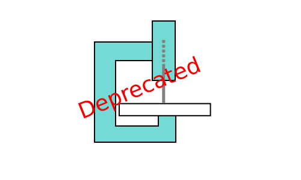

(gee-saw-feeder/chrome-gcode-sender)
===================

***NOTE: Google ended support for Chrome apps in 2022, so this application does not work anymore. 
Please see python based GeeSaw Feeder v2 for an alternative approach to similar functionality.***

What is this?
---------------------
**gcode-sender** is a chrome application capable of sending [gcode](http://en.wikipedia.org/wiki/Gcode) commands to a USB gcode intrepreter (hobby CNC machines / 3D printers). It was developed by [sir-buckyball](https://github.com/sir-buckyball/chrome-gcode-sender). 

This implementation, **gee-saw-feeder** (GeeSaw feeder), is a superficially retouched fork of that very solid app, which adapts it to a 2D (XY-only) gcode sender, matching the reqirements of a prototype grbl-based CNC scroll-saw machine called '**GeeSaw**'.

How to install it?
--------------------
The easiest way to install the gcode-sender chrome extension is to download it from the Chrome Web Store (<https://chrome.google.com/webstore/detail/gcode-sender/ngncibnakmabjlfpadjagnbdjbhoelom>).

If you want to develop for it, you can load the 'src' directory as an unpacked extension. By going to `<chrome://extensions/>`, ensure 'developer mode' is checked and you should see a program-starter (desktop configuration file) to load it from your local file system, by giving a unique 32-chararacter long reference-name as argument to google-chrome.

Unfortunately, this also means that you cannot simply download the source files from this repository and immediately launch it, since the necessary, randomly generated reference-name string for google-chrome is lacking. It seems the preferred procedure is to download a copy of the 'src' directory from the Chrome Web Store, as described above, and then edit or swap out files as desired.

Some control panel shortcuts:
-------------------------------------
<pre>
'←', 'j' - jog X axis -N
'→', 'l' - jog X axis +N
'↓', 'k' - jog Y axit -N
'↑', 'i' - jog Y axis +N
'+' - increment jump size by 10x
'-' - decrement jump size by 10x
'/' - focus command input
'esc' - blur command input
</pre>

Libraries used
---------------------------
* [paper.js](http://paperjs.org/) - canvas rendering library
* [Bootstrap](http://getbootstrap.com/) - layout library (makes things pretty)
* [Moment.js](http://momentjs.com/) - time library
* [jQuery](http://jquery.com/) - general javascript utilities
* [chrome.serial](http://developer.chrome.com/apps/serial.html) - chrome serial API

